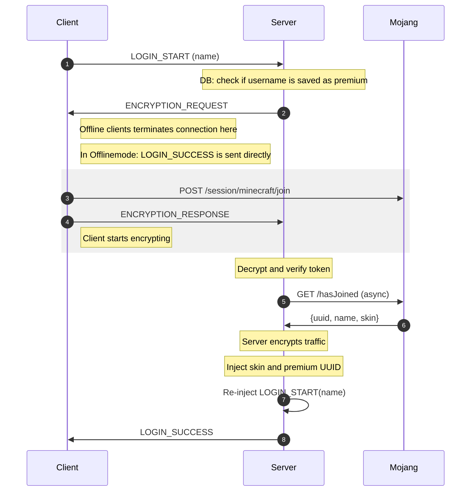

# FastLogin

This is the TDR-maintained fork of [games647/FastLogin](https://github.com/games647/FastLogin). The original project,
copyright notices, contributor history and MIT license are preserved. TDR maintains compatibility fixes and a small,
generic configuration-phase premium-identity protocol; it does not claim original authorship of FastLogin.

The current fork runtime target is Minecraft/Paper `26.1.2` build `74`, Purpur `2592`, Velocity
`3.5.0-SNAPSHOT` build `605` and Java `25.0.3`. AuthMe `6.0.0-b2734` is the intended TDR physical integration gate, not
a compatibility claim established by this standalone fork build. Other versions remain upstream compatibility rather
than a tested promise of this fork.

The fork starts from upstream commit `948613876e8239863ef9a7ce077184b1314efc2a`. Its first development artifact
version is `1.12.0-tdr.2-SNAPSHOT`; it is not an upstream FastLogin release. Maven packaging produces versioned names
such as `FastLoginBukkit-1.12.0-tdr.2-SNAPSHOT.jar` and `FastLoginVelocity-1.12.0-tdr.2-SNAPSHOT.jar`, so rollout and
rollback cannot silently confuse fork jars with upstream artifacts.


Checks if a Minecraft player has a paid account (premium). If so, they can skip offline authentication (auth plugins).
So they don't need to enter passwords. This is also called auto login (auto-login).

## Features

* Detect paid accounts from others
* Automatically login paid accounts (premium)
* Support various of auth plugins
* Premium UUID support
* Forward skins
* Detect username changed and will update the existing database record
* BungeeCord/Velocity support
* Auto register new premium players
* No client modifications needed
* Good performance by using async operations
* Locale messages
* Support for Bedrock players proxies through FloodGate
* Optional HMAC-authenticated premium claim during Velocity/Paper configuration

## Issues

Please use issues for bug reports, suggestions, questions and more. Please check for existing issues. Existing issues
can be voted up by adding up vote to the original post. Closing issues means that they are marked as resolved. Comments
are still allowed and it could be re-opened.

## Development builds

Development builds contain the latest changes from the Source-Code. They are bleeding edge and could introduce new bugs,
but also include features, enhancements and bug fixes that are not yet in a released version. If you click on the left
side on `Changes`, you can see iterative change sets leading to a specific build.

You can download them from here: [CodeMC(Jenkins)](https://ci.codemc.org/job/Games647/job/FastLogin/)

***

## Technical Authentication



### Early premium claim for configuration-phase authentication UI

Paper can open blocking login Dialogs before Velocity's `ServerConnectedEvent`. The legacy FastLogin proxy message is
therefore too late to suppress such UI. When `earlyPremiumClaim.enabled` is true, this fork sends a claim from
Velocity's initial, backend-bound `PlayerConfigurationEvent` on `fastlogin:premium_claim`. Velocity marks this event as
awaited, so the proxy finishes its handlers before it continues configuration. `PlayerEnteredConfigurationEvent` is a
different PLAY-to-CONFIG reconfiguration hook and does not cover the primary login path; this fork deliberately does
not use it for initial claims. The Bukkit module validates the claim while the connection still implements
`PlayerConfigurationConnection`, then fires `BukkitFastLoginPremiumClaimEvent` asynchronously.

The feature is opt-in and fail-closed. An absent, malformed, expired, replayed or incorrectly bound claim never grants
authentication and must not suppress a Dialog. The effective backend UUID is carried separately from the Mojang UUID,
so `premiumUuid: false` keeps existing inventories and permissions under the offline UUID.

Protocol v1 uses Java `DataOutputStream` encoding in this exact order:

| Field | Encoding |
| --- | --- |
| magic | int `0x464C5043` (`FLPC`) |
| version | unsigned byte `1` |
| issuer proxy ID | UUID as MSB long, LSB long |
| audience | `writeUTF`, exact Velocity registered-server name |
| username | `writeUTF`, lowercase using `Locale.ROOT` |
| effective UUID | UUID as MSB long, LSB long |
| Mojang UUID | UUID as MSB long, LSB long |
| issued / expires | two epoch-millisecond longs |
| nonce | UUID as MSB long, LSB long |
| client binding | 32 raw bytes: SHA-256 of the raw forwarded client IP bytes, without port |
| signature | 32 raw bytes: HMAC-SHA256 over every preceding byte |

The default TTL is 10 seconds; backends reject TTLs over 30 seconds, timestamps more than 5 seconds in the future and
nonces already consumed on that backend. They also require the configured audience, an allowed `proxyId`, the current
configuration profile's name/effective UUID and the forwarded client IP to match.

Configure the same environment-variable name on the proxy and backend, and put a minimum 32-byte random hex secret in
that environment variable. Do not put the secret in `config.yml`, logs, source control or startup arguments.

```yaml
earlyPremiumClaim:
  enabled: true
  sharedSecretEnvironmentVariable: 'FASTLOGIN_PREMIUM_CLAIM_SECRET'
  audience: 'lobby' # backend only; ignored by the Velocity sender
  ttlSeconds: 10
  maxTtlSeconds: 30
  maxFutureSkewSeconds: 5
```

Each backend still needs the Velocity `proxyId.txt` UUID in its `allowed-proxies.txt`. An authentication plugin consumes
`BukkitFastLoginPremiumClaimEvent` to approve its own pre-join flow; FastLogin does not silently dismiss another
plugin's Dialog.

The proxy's inherited delayed REGISTER/LOGIN bridge remains enabled by default for compatibility with installations
that run FastLogin on both proxy and backend. A backend that owns authentication independently can disable that bridge:

```yaml
sendLegacyBackendAuthMessages: false
```

With this setting Velocity does not schedule `ForceLoginTask`; the independent backend must send the existing empty
`fastlogin:succ` message only after its durable premium-auth operation succeeds. TDR uses this mode so Identity remains
the sole AuthMe owner. Do not disable the bridge for a normal two-sided FastLogin installation.

#### Reserved premium names

Keep `secondAttemptCracked: false` to reserve paid-account names. The localized `premium-name-reserved` message is
available to integrations that can control the rejection. Velocity's native online-mode negotiation can, however,
disconnect an unlicensed client with `Invalid session` before a plugin receives an event whose reason it can replace.
The public Velocity API therefore cannot guarantee custom reserved-name copy for every failed Mojang handshake. This
fork deliberately does not claim a 100% guarantee; achieving it requires a separately reviewed Velocity protocol patch.

For a deterministic explanation on the first attempt with a previously unknown Mojang-owned name, Velocity also has
an opt-in `premiumNamePreflight`. With `autoRegister: true`, it denies the first attempt using
`premium-name-preflight`, then stores one permit bound to the normalized name and a SHA-256 client-IP hash. The permit
expires in at most 60 seconds, is consumed by one retry, and only lets the existing FastLogin flow request Mojang
online-mode authentication. It is not identity proof and cannot bypass that authentication. An official owner
therefore reconnects once for a first-ever name; an offline user sees why the name is protected before a later failed
retry can fall back to Velocity's native message. The cache is bounded and does not log its keys.

`premiumNamePreflight` is incompatible with `secondAttemptCracked: true`. That fallback would allow the third attempt
to enter a cracked session before another Mojang lookup. If both options are configured, FastLogin logs an error,
disables preflight and forces `secondAttemptCracked` off in the in-memory runtime configuration. The underlying lookup
therefore continues reserving the paid name, but the first-attempt preflight copy is unavailable until the file is
corrected. Production configuration must set `secondAttemptCracked: false` explicitly.

```yaml
premiumNamePreflight:
  enabled: true
  permitTtlSeconds: 30
  maximumPendingPermits: 2000
```

## Commands

    /premium [player] Label the invoker or the argument as paid account
    /cracked [player] Label the invoker or the argument as cracked account

## Permissions

    fastlogin.bukkit.command.premium
    fastlogin.bukkit.command.cracked

    fastlogin.command.premium.other
    fastlogin.command.cracked.other

## Placeholder

This plugin supports `PlaceholderAPI` on `Spigot`. It exports the following variable
`%fastlogin_status%`. In BungeeCord environments, the status of a player will be delivered with a delay after the player
already successful joined the server. This takes about a couple of milliseconds. In this case the value
will be `Unknown`.

Possible values: `Premium`, `Cracked`, `Unknown`

## Requirements

* Java 25 for build and runtime
* Minecraft/Paper 26.1.2 build 74, or Purpur 2592 derived from that target
* Velocity runtime 3.5.0-SNAPSHOT build 605
* Backend and proxy in offline mode with secure Velocity forwarding and a firewall that blocks direct backend access
* An authentication plugin; AuthMe 6.0.0-b2734 is the intended TDR physical integration gate

The inherited BungeeCord and legacy auth-plugin modules still build, but they are not part of the compatibility promise
for this fork. Use upstream FastLogin for its broader legacy compatibility matrix.

Velocity does not publish runtime build `605` as an equivalent immutable `velocity-api` Maven coordinate. The runtime
and API build numbers must therefore not be treated as a mapping. This fork compiles through the resolvable
`3.5.0-SNAPSHOT` base coordinate but pins the audited resolved artifact
`3.5.0-20260711.003721-41` by SHA-256
`c4c3fcf3d5ef20bb7d5839211d6c27c57da4dbcc94cc44ecc304fa8dccb55ff0`; Maven validation fails on silent snapshot
drift. A clean environment consequently needs those exact bytes still available from PaperMC or a checksummed internal
mirror.

The inherited AuthMe hook still compiles against the authoritative CodeMC release `fr.xephi:authme:5.6.0`. As of this
fork cut, CodeMC metadata does not publish `6.0.0-b2734` under that coordinate, so declaring it in the POM would invent
an unavailable artifact. Compatibility with the intended TDR AuthMe runtime must be established by the combined
FastLogin/AuthMe adapter build and a physical login matrix before deployment.

### Supported auth plugins

#### Spigot/Paper

* [AdvancedLogin (Paid)](https://www.spigotmc.org/resources/advancedlogin.10510/)
* [AuthMe (5.X)](https://dev.bukkit.org/bukkit-plugins/authme-reloaded/)
* [CrazyLogin](https://dev.bukkit.org/bukkit-plugins/crazylogin/)
* [LoginSecurity](https://dev.bukkit.org/bukkit-plugins/loginsecurity/)
* [LogIt](https://github.com/games647/LogIt)
* [UltraAuth](https://dev.bukkit.org/bukkit-plugins/ultraauth-aa/)
* [UserLogin](https://www.spigotmc.org/resources/userlogin.80669/)
* [xAuth](https://dev.bukkit.org/bukkit-plugins/xauth/)

#### BungeeCord/Waterfall

* [BungeeAuth](https://www.spigotmc.org/resources/bungeeauth.493/)

## Network requests

This plugin performs network requests to:

* https://api.mojang.com - retrieving uuid data to decide if we should activate premium login
* https://sessionserver.mojang.com - verify if the player is the owner of that account

***

## How to install

### Spigot/Paper

1. Download and install ProtocolLib/ProtocolSupport
2. Download and install `FastLoginBukkit`
3. Set your server in offline mode by setting the value `onlinemode` in your server.properties to `false`

### BungeeCord/Waterfall or Velocity

Install the plugin on both platforms, that is proxy (BungeeCord or Velocity) and backend server (Spigot).

1. Activate proxy support in the server configuration
   * This is often found in `spigot.yml` or `paper.yml`
2. Restart the backend server
3. Now there is `allowed-proxies.txt` file in the FastLogin folder of the restarted server
    * BungeeCord: Put your `stats`-id from the BungeeCord config into this file
    * Velocity: On plugin startup the plugin generates a `proxyId.txt` inside the plugins folder of the proxy
4. Activate ip forwarding in your proxy config
5. Check your database settings in the config of FastLogin on your proxy
    * The proxies only ship with a limited set of drivers where Spigot supports more. Therefore, these are supported:
    * BungeeCord: `mysql` for MySQL/MariaDB
    * Velocity: `mariadb` for MySQL/MariaDB
    * Note the embedded file storage SQLite is not available
    * MySQL/MariaDB requires an external database server running. Check your server provider if there is one available
   or install one.
6. Set proxy and Spigot in offline mode by setting the value `onlinemode` in your `config.yml` to false
7. You should *always* configure the firewall for your Spigot server so that it's only accessible through your proxy
   * This is also the case without this plugin
   * https://www.spigotmc.org/wiki/bungeecord-installation/#post-installation
